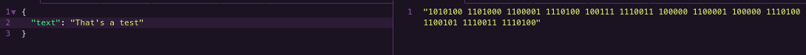
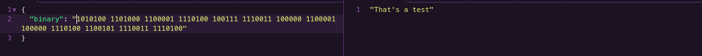

<h1 align="center">binary-text-flask</h1>
<p align="center">An API that transforms binary in text and text in binary (made with <a href="https://flask.palletsprojects.com/en/2.0.x/">Flask</a>).</p>

### What is that ?

This API was made with Python (Flask), and can transforms binary in text and text in binary.

### Requirements

- Python3
- Flask

### How to use

After download, run this command to start the app:

```
python3 src/server.py
```

### API/Routes

POST:
- `/text`: Transform text into binary.
- `/binary`: Transform binary into text.

### Examples

- Text:



<br>

- Binary:


